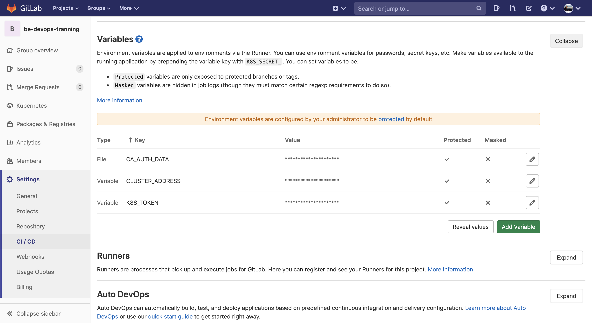

## Existing Kubernetes cluster
If you have an existing Kubernetes cluster, you can add it to a project, group, or instance. Using environments to setup k8s cluster in gitlab-ci:



3 important environment variables are required:
- CA_AUTH_DATA
- CLUSTER_ADDRESS
- K8S_TOKEN

### CA_AUTH_DATA
A valid Kubernetes certificate is needed to authenticate to the cluster. We will use the certificate created by default.
1. List the secrets with `kubectl get secrets`, and one should be named similar to `default-token-xxxxx`. Copy that token name for use below.
2. Get the certificate by running this command:
    ```shell script
    kubectl get secret <secret name> -o jsonpath="{['data']['ca\.crt']}" | base64 --decode
    ```
   
### CLUSTER_ADDRESS
**API URL** (required) - It’s the URL that GitLab uses to access the Kubernetes API. Kubernetes exposes several APIs, we want the “base” URL that is common to all of them.  
Get the API URL by running this command:
```shell script
kubectl cluster-info | grep 'Kubernetes master' | awk '/http/ {print $NF}'
```

### K8S_TOKEN
GitLab authenticates against Kubernetes using service tokens, which are scoped to a particular namespace.  
1. Create a file called [gitlab-admin-service-account.yaml](./gitlab-admin-service-account.yaml) with contents:
    ```yaml
    apiVersion: v1
    kind: ServiceAccount
    metadata:
      name: gitlab-admin
      namespace: kube-system
    ---
    apiVersion: rbac.authorization.k8s.io/v1beta1
    kind: ClusterRoleBinding
    metadata:
      name: gitlab-admin
    roleRef:
      apiGroup: rbac.authorization.k8s.io
      kind: ClusterRole
      name: cluster-admin
    subjects:
      - kind: ServiceAccount
        name: gitlab-admin
        namespace: kube-system
    ```
2. Apply the service account and cluster role binding to your cluster:
   ```shell script
    kubectl apply -f gitlab-admin-service-account.yaml
    ```
    You will need the `container.clusterRoleBindings.create` permission to create cluster-level roles. If you do not have this permission, you can alternatively enable Basic Authentication and then run the `kubectl apply` command as an admin:
    ```shell script
    kubectl apply -f gitlab-admin-service-account.yaml --username=admin --password=<password>
    ```
   > **Note**: Basic Authentication can be turned on and the password credentials can be obtained using the Google Cloud Console.  
3. Retrieve the token for the `gitlab-admin` service account:
    ```shell script
    kubectl -n kube-system describe secret $(kubectl -n kube-system get secret | grep gitlab-admin | awk '{print $1}')
    ```